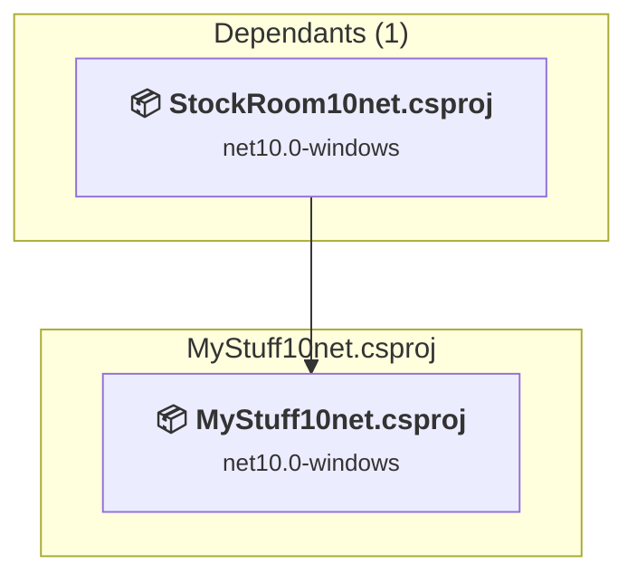
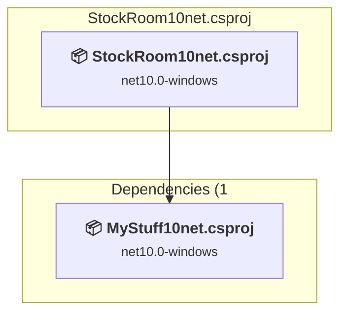

# Projects and dependencies analysis

This document provides a comprehensive overview of the projects and their dependencies in the context of upgrading to .NETCoreApp,Version=v11.0.

## Table of Contents

- [Executive Summary](#executive-Summary)
  - [Highlevel Metrics](#highlevel-metrics)
  - [Projects Compatibility](#projects-compatibility)
  - [Package Compatibility](#package-compatibility)
  - [API Compatibility](#api-compatibility)
- [Aggregate NuGet packages details](#aggregate-nuget-packages-details)
- [Top API Migration Challenges](#top-api-migration-challenges)
  - [Technologies and Features](#technologies-and-features)
  - [Most Frequent API Issues](#most-frequent-api-issues)
- [Projects Relationship Graph](#projects-relationship-graph)
- [Project Details](#project-details)

  - [MyStuff10net\MyStuff10net.csproj](#mystuff10netmystuff10netcsproj)
  - [StockRoom10net.csproj](#stockroom10netcsproj)

## Executive Summary

### Highlevel Metrics

| Metric | Count | Status |
| :--- | :---: | :--- |
| Total Projects | 2 | All require upgrade |
| Total NuGet Packages | 32 | 12 need upgrade |
| Total Code Files | 358 |  |
| Total Code Files with Incidents | 247 |  |
| Total Lines of Code | 168304 |  |
| Total Number of Issues | 99672 |  |
| Estimated LOC to modify | 99657+ | at least 59.2% of codebase |

### Projects Compatibility

| Project | Target Framework | Difficulty | Package Issues | API Issues | Est. LOC Impact | Description |
| :--- | :---: | :---: | :---: | :---: | :---: | :--- |
| [MyStuff10net\MyStuff10net.csproj](#mystuff10netmystuff10netcsproj) | net10.0-windows | 🟡 Medium | 5 | 50510 | 50510+ | ClassLibrary, Sdk Style = True |
| [StockRoom10net.csproj](#stockroom10netcsproj) | net10.0-windows | 🟡 Medium | 8 | 49147 | 49147+ | WinForms, Sdk Style = True |

### Package Compatibility

| Status | Count | Percentage |
| :--- | :---: | :---: |
| ✅ Compatible | 20 | 62.5% |
| ⚠️ Incompatible | 2 | 6.3% |
| 🔄 Upgrade Recommended | 10 | 31.3% |
| ***Total NuGet Packages*** | ***32*** | ***100%*** |

### API Compatibility

| Category | Count | Impact |
| :--- | :---: | :--- |
| 🔴 Binary Incompatible | 69365 | High - Require code changes |
| 🟡 Source Incompatible | 30263 | Medium - Needs re-compilation and potential conflicting API error fixing |
| 🔵 Behavioral change | 29 | Low - Behavioral changes that may require testing at runtime |
| ✅ Compatible | 114329 |  |
| ***Total APIs Analyzed*** | ***213986*** |  |

## Aggregate NuGet packages details

| Package | Current Version | Suggested Version | Projects | Description |
| :--- | :---: | :---: | :--- | :--- |
| Be.Windows.Forms.HexBox.Net5 | 1.8.0 |  | [StockRoom10net.csproj](#stockroom10netcsproj) | ✅Compatible |
| Blazor.Extensions.Canvas | 1.1.1 |  | [StockRoom10net.csproj](#stockroom10netcsproj) | ✅Compatible |
| GenCode128 | 2.0.0 |  | [MyStuff10net.csproj](#mystuff10netmystuff10netcsproj) [StockRoom10net.csproj](#stockroom10netcsproj) | ✅Compatible |
| Microsoft.AspNetCore.Components.Authorization | 10.0.3 |  | [StockRoom10net.csproj](#stockroom10netcsproj) | ✅Compatible |
| Microsoft.AspNetCore.Components.WebView | 10.0.3 |  | [StockRoom10net.csproj](#stockroom10netcsproj) | ✅Compatible |
| microsoft.aspnetcore.components.webview.windowsforms | 9.0.10 |  | [MyStuff10net.csproj](#mystuff10netmystuff10netcsproj) | ⚠️NuGet package is incompatible |
| Microsoft.AspNetCore.Components.WebView.WindowsForms | 10.0.30 |  | [StockRoom10net.csproj](#stockroom10netcsproj) | ⚠️NuGet package is incompatible |
| Microsoft.AspNetCore.Mvc.Razor.Extensions | 6.0.0 |  | [MyStuff10net.csproj](#mystuff10netmystuff10netcsproj) | NuGet package functionality is included with framework reference |
| Microsoft.AspNetCore.Mvc.Razor.RuntimeCompilation | 10.0.3 |  | [StockRoom10net.csproj](#stockroom10netcsproj) | ✅Compatible |
| Microsoft.AspNetCore.Mvc.RazorPages | 2.3.0 |  | [MyStuff10net.csproj](#mystuff10netmystuff10netcsproj) | ✅Compatible |
| Microsoft.CodeAnalysis.NetAnalyzers | 10.0.103 |  | [StockRoom10net.csproj](#stockroom10netcsproj) | ✅Compatible |
| Microsoft.Data.Sqlite.Core | 10.0.3 |  | [StockRoom10net.csproj](#stockroom10netcsproj) | ✅Compatible |
| Microsoft.EntityFrameworkCore | 10.0.2 | 10.0.3 | [StockRoom10net.csproj](#stockroom10netcsproj) | NuGet package upgrade is recommended |
| Microsoft.EntityFrameworkCore.Design | 10.0.2 | 10.0.3 | [StockRoom10net.csproj](#stockroom10netcsproj) | NuGet package upgrade is recommended |
| Microsoft.EntityFrameworkCore.Sqlite | 10.0.2 | 10.0.3 | [StockRoom10net.csproj](#stockroom10netcsproj) | NuGet package upgrade is recommended |
| Microsoft.EntityFrameworkCore.Sqlite.Core | 10.0.2 | 10.0.3 | [StockRoom10net.csproj](#stockroom10netcsproj) | NuGet package upgrade is recommended |
| Microsoft.EntityFrameworkCore.Sqlite.NetTopologySuite | 10.0.2 | 10.0.3 | [StockRoom10net.csproj](#stockroom10netcsproj) | NuGet package upgrade is recommended |
| Microsoft.EntityFrameworkCore.Tools | 10.0.2 | 10.0.3 | [StockRoom10net.csproj](#stockroom10netcsproj) | NuGet package upgrade is recommended |
| Microsoft.Extensions.DependencyInjection | 10.0.0-preview.5.25277.114 | 10.0.3 | [MyStuff10net.csproj](#mystuff10netmystuff10netcsproj) | NuGet package upgrade is recommended |
| Microsoft.Extensions.DependencyInjection.Abstractions | 10.0.0-preview.5.25277.114 | 10.0.3 | [MyStuff10net.csproj](#mystuff10netmystuff10netcsproj) | NuGet package upgrade is recommended |
| Microsoft.Extensions.FileProviders.Physical | 10.0.0-preview.5.25277.114 | 10.0.3 | [MyStuff10net.csproj](#mystuff10netmystuff10netcsproj) | NuGet package upgrade is recommended |
| Microsoft.Extensions.Logging | 10.0.3 |  | [StockRoom10net.csproj](#stockroom10netcsproj) | ✅Compatible |
| Microsoft.Extensions.Logging.Console | 10.0.3 |  | [StockRoom10net.csproj](#stockroom10netcsproj) | ✅Compatible |
| Microsoft.Extensions.Logging.Debug | 10.0.3 |  | [StockRoom10net.csproj](#stockroom10netcsproj) | ✅Compatible |
| Microsoft.JSInterop | 10.0.3 |  | [StockRoom10net.csproj](#stockroom10netcsproj) | ✅Compatible |
| Newtonsoft.Json | 13.0.5-beta1 | 13.0.4 | [StockRoom10net.csproj](#stockroom10netcsproj) | NuGet package upgrade is recommended |
| System.Data.OleDb | 10.0.3 |  | [StockRoom10net.csproj](#stockroom10netcsproj) | ✅Compatible |
| System.Data.SQLite | 2.0.2 |  | [StockRoom10net.csproj](#stockroom10netcsproj) | ✅Compatible |
| System.Data.SQLite.Core | 1.0.119 |  | [StockRoom10net.csproj](#stockroom10netcsproj) | ✅Compatible |
| System.Data.SQLite.EF6 | 2.0.2 |  | [StockRoom10net.csproj](#stockroom10netcsproj) | ✅Compatible |
| System.Management | 10.0.3 |  | [StockRoom10net.csproj](#stockroom10netcsproj) | ✅Compatible |
| System.Speech | 10.0.3 |  | [StockRoom10net.csproj](#stockroom10netcsproj) | ✅Compatible |

## Top API Migration Challenges

### Technologies and Features

| Technology | Issues | Percentage | Migration Path |
| :--- | :---: | :---: | :--- |
| Windows Forms | 69347 | 69.6% | Windows Forms APIs for building Windows desktop applications with traditional Forms-based UI that are available in .NET on Windows. Enable Windows Desktop support: Option 1 (Recommended): Target net9.0-windows; Option 2: Add <UseWindowsDesktop>true</UseWindowsDesktop>; Option 3 (Legacy): Use Microsoft.NET.Sdk.WindowsDesktop SDK. |
| GDI+ / System.Drawing | 7814 | 7.8% | System.Drawing APIs for 2D graphics, imaging, and printing that are available via NuGet package System.Drawing.Common. Note: Not recommended for server scenarios due to Windows dependencies; consider cross-platform alternatives like SkiaSharp or ImageSharp for new code. |
| Windows Forms Legacy Controls | 3585 | 3.6% | Legacy Windows Forms controls that have been removed from .NET Core/5+ including StatusBar, DataGrid, ContextMenu, MainMenu, MenuItem, and ToolBar. These controls were replaced by more modern alternatives. Use ToolStrip, MenuStrip, ContextMenuStrip, and DataGridView instead. |
| Legacy Configuration System | 254 | 0.3% | Legacy XML-based configuration system (app.config/web.config) that has been replaced by a more flexible configuration model in .NET Core. The old system was rigid and XML-based. Migrate to Microsoft.Extensions.Configuration with JSON/environment variables; use System.Configuration.ConfigurationManager NuGet package as interim bridge if needed. |
| Speech & Voice Recognition | 25 | 0.0% | System.Speech APIs for speech recognition and synthesis that are not available in .NET Core/.NET. These Windows-specific APIs have been superseded by cloud-based services. Use Azure Cognitive Services Speech or other modern speech APIs. |
| System Management (WMI) | 13 | 0.0% | Windows Management Instrumentation (WMI) APIs for system administration and monitoring that are available via NuGet package System.Management. These APIs provide access to Windows system information but are Windows-only; consider cross-platform alternatives for new code. |
| Code Access Security (CAS) | 3 | 0.0% | Code Access Security (CAS) APIs that were removed in .NET Core/.NET for security and performance reasons. CAS provided fine-grained security policies but proved complex and ineffective. Remove CAS usage; not supported in modern .NET. |

### Most Frequent API Issues

| API | Count | Percentage | Category |
| :--- | :---: | :---: | :--- |
| T:System.Windows.Forms.Label | 4071 | 4.1% | Binary Incompatible |
| T:System.Data.OleDb.OleDbDataAdapter | 2837 | 2.8% | Source Incompatible |
| T:System.Data.OleDb.OleDbParameter | 2642 | 2.7% | Source Incompatible |
| T:System.Data.OleDb.OleDbCommand | 2592 | 2.6% | Source Incompatible |
| T:System.Windows.Forms.ToolStripMenuItem | 2428 | 2.4% | Binary Incompatible |
| T:System.Windows.Forms.Padding | 2411 | 2.4% | Binary Incompatible |
| T:System.Windows.Forms.Panel | 2235 | 2.2% | Binary Incompatible |
| T:System.Windows.Forms.DockStyle | 2233 | 2.2% | Binary Incompatible |
| T:System.Windows.Forms.ComboBox | 2195 | 2.2% | Binary Incompatible |
| T:System.Data.OleDb.OleDbParameterCollection | 1956 | 2.0% | Source Incompatible |
| P:System.Data.OleDb.OleDbCommand.Parameters | 1956 | 2.0% | Source Incompatible |
| P:System.Windows.Forms.Control.Name | 1421 | 1.4% | Binary Incompatible |
| T:System.Windows.Forms.Control.ControlCollection | 1413 | 1.4% | Binary Incompatible |
| P:System.Windows.Forms.Control.Controls | 1409 | 1.4% | Binary Incompatible |
| T:System.Data.OleDb.OleDbType | 1372 | 1.4% | Source Incompatible |
| P:System.Windows.Forms.Control.Size | 1332 | 1.3% | Binary Incompatible |
| T:System.Windows.Forms.Button | 1329 | 1.3% | Binary Incompatible |
| P:System.Windows.Forms.Control.Location | 1287 | 1.3% | Binary Incompatible |
| P:System.Data.OleDb.OleDbDataAdapter.InsertCommand | 1277 | 1.3% | Source Incompatible |
| M:System.Windows.Forms.Control.ControlCollection.Add(System.Windows.Forms.Control) | 1274 | 1.3% | Binary Incompatible |
| P:System.Data.OleDb.OleDbParameterCollection.Item(System.Int32) | 1270 | 1.3% | Source Incompatible |
| P:System.Data.OleDb.OleDbParameter.Value | 1270 | 1.3% | Source Incompatible |
| P:System.Windows.Forms.Control.TabIndex | 1179 | 1.2% | Binary Incompatible |
| T:System.Windows.Forms.TextBox | 1095 | 1.1% | Binary Incompatible |
| T:System.Drawing.Font | 1084 | 1.1% | Source Incompatible |
| T:System.Windows.Forms.BindingSource | 1025 | 1.0% | Binary Incompatible |
| P:System.Data.OleDb.OleDbDataAdapter.UpdateCommand | 1023 | 1.0% | Source Incompatible |
| T:System.Windows.Forms.TabPage | 990 | 1.0% | Binary Incompatible |
| T:System.Drawing.FontStyle | 926 | 0.9% | Source Incompatible |
| P:System.Windows.Forms.Control.Margin | 907 | 0.9% | Binary Incompatible |
| T:System.Windows.Forms.FlowLayoutPanel | 795 | 0.8% | Binary Incompatible |
| T:System.Windows.Forms.SplitContainer | 757 | 0.8% | Binary Incompatible |
| T:System.Drawing.Icon | 741 | 0.7% | Source Incompatible |
| T:System.Windows.Forms.CheckBox | 716 | 0.7% | Binary Incompatible |
| P:System.Windows.Forms.Control.Dock | 698 | 0.7% | Binary Incompatible |
| M:System.Data.OleDb.OleDbParameter.#ctor(System.String,System.Data.OleDb.OleDbType,System.Int32,System.Data.ParameterDirection,System.Byte,System.Byte,System.String,System.Data.DataRowVersion,System.Boolean,System.Object) | 686 | 0.7% | Source Incompatible |
| M:System.Data.OleDb.OleDbParameterCollection.Add(System.Data.OleDb.OleDbParameter) | 686 | 0.7% | Source Incompatible |
| T:System.Drawing.GraphicsUnit | 672 | 0.7% | Source Incompatible |
| T:System.Windows.Forms.MessageBoxButtons | 670 | 0.7% | Binary Incompatible |
| T:System.Windows.Forms.MessageBoxIcon | 668 | 0.7% | Binary Incompatible |
| M:System.Windows.Forms.Padding.#ctor(System.Int32) | 656 | 0.7% | Binary Incompatible |
| T:System.Windows.Forms.DialogResult | 639 | 0.6% | Binary Incompatible |
| M:System.Windows.Forms.Control.SuspendLayout | 620 | 0.6% | Binary Incompatible |
| P:System.Windows.Forms.Label.Text | 616 | 0.6% | Binary Incompatible |
| M:System.Windows.Forms.Control.ResumeLayout(System.Boolean) | 604 | 0.6% | Binary Incompatible |
| T:System.Data.OleDb.OleDbConnection | 594 | 0.6% | Source Incompatible |
| T:System.Windows.Forms.ToolStripButton | 549 | 0.6% | Binary Incompatible |
| M:System.Windows.Forms.Padding.#ctor(System.Int32,System.Int32,System.Int32,System.Int32) | 548 | 0.5% | Binary Incompatible |
| P:System.Windows.Forms.Control.Font | 468 | 0.5% | Binary Incompatible |
| T:System.Windows.Forms.ToolStripSeparator | 465 | 0.5% | Binary Incompatible |

## Projects Relationship Graph

Legend:
📦 SDK-style project
⚙️ Classic project

## Project Details

### MyStuff10net\MyStuff10net.csproj

#### Project Info

- **Current Target Framework:** net10.0-windows
- **Proposed Target Framework:** net11.0--windows
- **SDK-style**: True
- **Project Kind:** ClassLibrary
- **Dependencies**: 0
- **Dependants**: 1
- **Number of Files**: 386
- **Number of Files with Incidents**: 205
- **Lines of Code**: 101026
- **Estimated LOC to modify**: 50510+ (at least 50.0% of the project)

#### Dependency Graph

Legend:
📦 SDK-style project
⚙️ Classic project

### API Compatibility

| Category | Count | Impact |
| :--- | :---: | :--- |
| 🔴 Binary Incompatible | 43869 | High - Require code changes |
| 🟡 Source Incompatible | 6624 | Medium - Needs re-compilation and potential conflicting API error fixing |
| 🔵 Behavioral change | 17 | Low - Behavioral changes that may require testing at runtime |
| ✅ Compatible | 68658 |  |
| ***Total APIs Analyzed*** | ***119168*** |  |

#### Project Technologies and Features

| Technology | Issues | Percentage | Migration Path |
| :--- | :---: | :---: | :--- |
| Code Access Security (CAS) | 3 | 0.0% | Code Access Security (CAS) APIs that were removed in .NET Core/.NET for security and performance reasons. CAS provided fine-grained security policies but proved complex and ineffective. Remove CAS usage; not supported in modern .NET. |
| Legacy Configuration System | 241 | 0.5% | Legacy XML-based configuration system (app.config/web.config) that has been replaced by a more flexible configuration model in .NET Core. The old system was rigid and XML-based. Migrate to Microsoft.Extensions.Configuration with JSON/environment variables; use System.Configuration.ConfigurationManager NuGet package as interim bridge if needed. |
| Windows Forms Legacy Controls | 3200 | 6.3% | Legacy Windows Forms controls that have been removed from .NET Core/5+ including StatusBar, DataGrid, ContextMenu, MainMenu, MenuItem, and ToolBar. These controls were replaced by more modern alternatives. Use ToolStrip, MenuStrip, ContextMenuStrip, and DataGridView instead. |
| GDI+ / System.Drawing | 6341 | 12.6% | System.Drawing APIs for 2D graphics, imaging, and printing that are available via NuGet package System.Drawing.Common. Note: Not recommended for server scenarios due to Windows dependencies; consider cross-platform alternatives like SkiaSharp or ImageSharp for new code. |
| Windows Forms | 43851 | 86.8% | Windows Forms APIs for building Windows desktop applications with traditional Forms-based UI that are available in .NET on Windows. Enable Windows Desktop support: Option 1 (Recommended): Target net9.0-windows; Option 2: Add <UseWindowsDesktop>true</UseWindowsDesktop>; Option 3 (Legacy): Use Microsoft.NET.Sdk.WindowsDesktop SDK. |

### StockRoom10net.csproj

#### Project Info

- **Current Target Framework:** net10.0-windows
- **Proposed Target Framework:** net11.0-windows
- **SDK-style**: True
- **Project Kind:** WinForms
- **Dependencies**: 1
- **Dependants**: 0
- **Number of Files**: 508
- **Number of Files with Incidents**: 42
- **Lines of Code**: 67278
- **Estimated LOC to modify**: 49147+ (at least 73.1% of the project)

#### Dependency Graph

Legend:
📦 SDK-style project
⚙️ Classic project

### API Compatibility

| Category | Count | Impact |
| :--- | :---: | :--- |
| 🔴 Binary Incompatible | 25496 | High - Require code changes |
| 🟡 Source Incompatible | 23639 | Medium - Needs re-compilation and potential conflicting API error fixing |
| 🔵 Behavioral change | 12 | Low - Behavioral changes that may require testing at runtime |
| ✅ Compatible | 45671 |  |
| ***Total APIs Analyzed*** | ***94818*** |  |

#### Project Technologies and Features

| Technology | Issues | Percentage | Migration Path |
| :--- | :---: | :---: | :--- |
| System Management (WMI) | 13 | 0.0% | Windows Management Instrumentation (WMI) APIs for system administration and monitoring that are available via NuGet package System.Management. These APIs provide access to Windows system information but are Windows-only; consider cross-platform alternatives for new code. |
| Speech & Voice Recognition | 25 | 0.1% | System.Speech APIs for speech recognition and synthesis that are not available in .NET Core/.NET. These Windows-specific APIs have been superseded by cloud-based services. Use Azure Cognitive Services Speech or other modern speech APIs. |
| Legacy Configuration System | 13 | 0.0% | Legacy XML-based configuration system (app.config/web.config) that has been replaced by a more flexible configuration model in .NET Core. The old system was rigid and XML-based. Migrate to Microsoft.Extensions.Configuration with JSON/environment variables; use System.Configuration.ConfigurationManager NuGet package as interim bridge if needed. |
| Windows Forms Legacy Controls | 385 | 0.8% | Legacy Windows Forms controls that have been removed from .NET Core/5+ including StatusBar, DataGrid, ContextMenu, MainMenu, MenuItem, and ToolBar. These controls were replaced by more modern alternatives. Use ToolStrip, MenuStrip, ContextMenuStrip, and DataGridView instead. |
| GDI+ / System.Drawing | 1473 | 3.0% | System.Drawing APIs for 2D graphics, imaging, and printing that are available via NuGet package System.Drawing.Common. Note: Not recommended for server scenarios due to Windows dependencies; consider cross-platform alternatives like SkiaSharp or ImageSharp for new code. |
| Windows Forms | 25496 | 51.9% | Windows Forms APIs for building Windows desktop applications with traditional Forms-based UI that are available in .NET on Windows. Enable Windows Desktop support: Option 1 (Recommended): Target net9.0-windows; Option 2: Add <UseWindowsDesktop>true</UseWindowsDesktop>; Option 3 (Legacy): Use Microsoft.NET.Sdk.WindowsDesktop SDK. |

